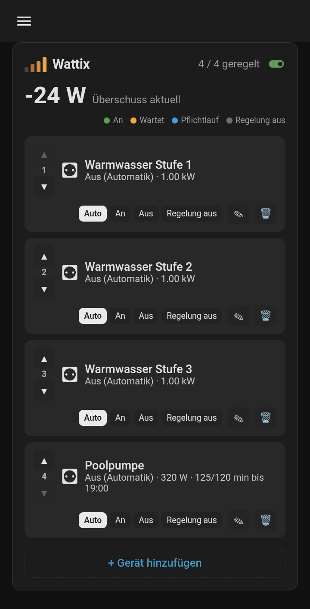

<p align="center"></p>

# Wattix – Energie intelligent steuern

Eine generische PV-Überschusssteuerung für Home Assistant. Statt fester
Heizstufen legst du beliebige Geräte (z. B. Relais eines Shelly 4PM) direkt
im mitgelieferten Dashboard-Interface an, priorisierst sie per Reihenfolge
und stellst Leistungsbedarf sowie Ein-/Ausschaltverzögerung pro Gerät ein.

## Wie es funktioniert

Nach der Einrichtung hinterlegst du nur einen Sensor, der die aktuelle
**Netz-Einspeiseleistung** liefert. Alles Weitere passiert im Interface
(einer eigenen Dashboard-Karte):

- Du legst ein **Gerät** an: Name, zu schaltende `switch`-Entität und
  **Leistungsbedarf in Watt** – dieser Wert ist zugleich die
  Einschaltschwelle.
- Beispiel: Gerät B braucht 200 W, Gerät A braucht 500 W. Sobald über
  200 W eingespeist werden, schaltet B ein. Bleibt der Überschuss weiter
  hoch genug (Gerät B zieht die 200 W ja bereits ab), schaltet danach A
  ein, sobald zusätzlich 500 W Überschuss anstehen. Reicht der Überschuss
  von Anfang an für mehrere Geräte auf einmal (z. B. 3 kW Überschuss für
  zwei Geräte mit je 1 kW), zählen deren Einschaltverzögerungen auch
  gleichzeitig herunter statt nacheinander – die tatsächlichen
  Einschaltvorgänge liegen trotzdem mindestens 10 Sekunden auseinander.
- **Priorität** ergibt sich aus der Reihenfolge der Geräteliste (per
  Pfeiltasten verschiebbar): Das oberste Gerät schaltet zuerst ein und
  zuletzt wieder ab (LIFO – wie ein Wasserstand, der auf- und abfüllt).
  Fällt der Überschuss komplett weg, schaltet Wattix die aktiven Geräte
  nacheinander ab statt alle gleichzeitig – zwischen zwei Abschaltungen
  liegen mindestens 10 Sekunden. Reicht der verbleibende Überschuss von
  vornherein für mehrere Geräte nicht mehr, zählen auch deren
  Ausschaltverzögerungen gleichzeitig herunter statt nacheinander.
- Pro Gerät stellst du ein, **wie lange** der Überschuss anstehen muss,
  bevor zugeschaltet wird (Einschaltverzögerung), und wie lange er
  **weg** sein muss, bevor wieder abgeschaltet wird (Ausschaltverzögerung)
  – Standard jeweils 5 Minuten. Ein einzelner kurzer Ausreißer (z. B. ein
  Speicher/Akku, der beim Nachregeln kurz ins Plus pendelt) unterbricht
  eine schon laufende Verzögerung nicht sofort – erst wenn der Ausreißer
  30 Sekunden anhält, zählt er als echte Änderung.
- Eine Hysterese (Standard 100 W, unter „Erweitert") verhindert, dass ein
  Gerät bei schwankendem Überschuss knapp an der Schwelle flattert.
- Jedes Gerät lässt sich jederzeit manuell auf **An** oder **Aus**
  erzwingen, unabhängig von der Automatik. Ein globaler Automatik-Schalter
  schaltet die gesamte Kaskade ein/aus.
- Optional (unter „Erweitert") eine **Mindestlaufzeit pro Tag** mit
  Uhrzeit: Hat ein Gerät bis zu dieser Uhrzeit die eingestellte Laufzeit
  noch nicht erreicht, schaltet Wattix es rechtzeitig davor auch **ohne
  Überschuss** ein, bis das Tagesziel erfüllt ist. Beispiel: Poolpumpe,
  2 h Mindestlaufzeit, Deadline 19:00 – hat sie um 17:00 erst 30 Minuten
  gelaufen, schaltet sie spätestens um 17:30 zwangsweise ein, damit die
  restlichen 1,5 h bis 19:00 noch reinpassen. Der Zähler setzt sich um
  Mitternacht zurück; die Karte zeigt den Fortschritt an der Geräte-Zeile.
- Optional (unter „Erweitert") eine **Mindestlaufzeit pro Aktivierung**:
  Ist ein Gerät einmal eingeschaltet, bleibt es mindestens diese Zeit an –
  auch wenn der Überschuss vorher wegfällt. Nützlich für Geräte, die nicht
  ständig kurz an- und wieder ausgeschaltet werden sollen (z. B. eine Pumpe).
- Unten in der Karte gibt es ein ausklappbares **Einstellungen**-Feld mit
  einem **Sensor-Timeout** (Minuten, leer = aus): Kommt vom Einspeise-Sensor
  so lange kein neuer Wert (z. B. weil er ausgefallen ist), schaltet Wattix
  sicherheitshalber alle aktiven Geräte (außer „Regelung aus") nacheinander
  im 10-Sekunden-Takt ab – unabhängig vom Automatik-Schalter. Solange das
  der Fall ist, zeigt die Karte oben eine rote Meldung an.

Alle Änderungen (Gerät hinzufügen/bearbeiten/löschen/verschieben) wirken
sofort – kein Neustart, kein YAML.

Die Integration bringt ihr Marken-Icon selbst mit (`custom_components/wattix/brand/`)
und wird ab Home Assistant 2026.3.0 automatisch mit eigenem Icon statt eines
Platzhalters angezeigt – ganz ohne separate Einreichung.

## Installation über HACS

1. HACS → Integrationen → Menü (⋮) → *Benutzerdefinierte Repositories*.
2. Repository-URL hinzufügen, Kategorie **Integration**.
3. „Wattix" installieren und Home Assistant neu starten.
4. Einstellungen → Geräte & Dienste → Integration hinzufügen → „Wattix".

## Einrichtung

Im Config-Flow wählst du nur:

1. **Sensor Einspeiseleistung** – ein `sensor`-Entity mit der aktuellen
   Netzleistung in Watt (positiv = Einspeisung). Zeigt dein Sensor
   Einspeisung als negativen Wert an, aktiviere „Sensor zeigt Einspeisung
   als negativen Wert an".

Das war's – Geräte fügst du danach im Interface hinzu.

## Sidebar-Button

Nach der Einrichtung erscheint automatisch ein **„Wattix"-Eintrag in der
linken Seitenleiste** (Icon ⚡) – ein Klick öffnet das Interface direkt,
ganzflächig, ohne dass du dafür ein eigenes Dashboard anlegen musst.

## Dashboard-Karte

Wer die Geräteliste zusätzlich in ein bestehendes Dashboard einbetten
möchte: Die Integration liefert dafür auch eine eigene Lovelace-Karte mit,
die automatisch als Frontend-Ressource registriert wird. Füge sie zu einem
Dashboard hinzu:

```yaml
type: custom:wattix-card
```

Mehr braucht es nicht – die Karte findet deine Wattix-Instanz
automatisch. Optional lässt sich ein Titel setzen oder (bei mehreren
Instanzen) die passende explizit auswählen:

```yaml
type: custom:wattix-card
title: PV-Überschuss
entry_id: 01H...   # zu finden in der URL unter Einstellungen → Geräte & Dienste → Wattix
```

Die Karte zeigt:

- den aktuellen Überschuss und einen Automatik-Umschalter,
- eine Geräteliste mit Status, Restzeit bis zur nächsten Schaltung,
  Auf/Ab-Pfeilen zum Priorisieren, Auto/An/Aus-Buttons, sowie
  Bearbeiten- und Löschen-Aktionen,
- einen „+ Gerät hinzufügen"-Button mit Formular (Name, Schalter,
  Leistungsbedarf, Verzögerungen, erweitert: Hysterese).

<p align="center">
  
</p>

## Erzeugte Entitäten

Pro Instanz wird ein Gerät „Wattix" mit zwei zusätzlichen
Entitäten für Dashboards/Automatisierungen angelegt:

| Entität | Domain | Beschreibung |
|---|---|---|
| Automatik | `switch` | Schaltet die gesamte Kaskadensteuerung ein/aus |
| Überschuss | `sensor` | Aktuelle Einspeiseleistung (normalisiert, W) |
| Geregelte Geräte | `sensor` | Anzahl Geräte im Modus Auto (unabhängig davon, ob sie gerade an oder aus sind) |

Die einzelnen Geräte selbst (Name, Priorität, Status, Schwellen) sind
bewusst **keine** eigenen HA-Entitäten, sondern eine dynamische Liste, die
über die Karte bzw. die WebSocket-API/Services verwaltet wird – so lassen
sich Geräte live hinzufügen, ohne dass die Integration neu geladen werden
muss.

## Automatisierung / Services

Für Skripte und Automatisierungen stehen folgende Services bereit
(Parameter siehe Dienste-Übersicht in Home Assistant):

- `wattix.add_device`
- `wattix.remove_device`
- `wattix.set_device_mode` (`auto` / `on` / `off`)
- `wattix.set_auto_mode`

Die Geräte-ID (`device_id`) eines Geräts findest du in der Karte oder per
Entwicklerwerkzeuge → WebSocket-Befehl `wattix/list_devices`
(mit der `entry_id` der jeweiligen Instanz).

## Beispiel: Shelly 4PM

Ein Shelly 4PM stellt vier Relais als eigene `switch`-Entitäten bereit
(`switch.<gerät>_kanal_1` … `_4`). Jedes davon kann als eigenes Gerät im
Interface angelegt werden. Die vom Shelly gemessene Gesamtleistung eignet
sich – falls kein separater Netzzähler vorhanden ist – ebenfalls als
„Sensor Einspeiseleistung", sofern er die Netzeinspeisung (nicht nur den
Verbrauch der geschalteten Geräte) abbildet.
